# Symbol & Relation Window

A Visual Studio Code extension that provides a "Source Insight"-like experience. It offers a dedicated side panel for **Symbol Navigation** (Current Document & Workspace Search), a **Relation Window** for call hierarchy analysis, and a **Reference Window** for global lookup, all with a native look and feel.

## Requirements

This extension relies on VS Code's built-in symbol providers. You must have a language extension installed for the files you are editing (e.g., C/C++ extension for `.c/.cpp` files, TypeScript extension for `.ts` files).

**Optional Integration:**
This extension seamlessly integrates with the **Context Window** extension. If installed, clicking a symbol in the list will automatically preview its definition in the Context Window, allowing you to browse code structure without losing your place in the main editor. 
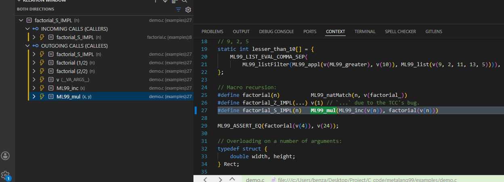

**Note on Large Projects:**
If you open a large workspace, the extension may show a "Waiting for symbol provider..." status initially while the language server (e.g., C/C++ IntelliSense) warms up. Once the provider is ready, the extension will automatically start **background indexing**, indicated by a progress bar and spinner animation in the view. You can continue using the extension (Standard Mode) while indexing completes.

## Keybindings

| Command | Keybinding | Condition |
| :--- | :--- | :--- |
| **Symbol Window** | | |
| Focus Project Search | `Ctrl+T` | `config.symbolWindow.enable` |
| Focus Current Search | `Ctrl+Shift+O` | `config.symbolWindow.enable` |
| **Relation Window** | | |
| Manual Search | `Shift+Alt+H` | `config.relationWindow.enable` |
| **Reference Window** | | |
| Lookup References | `Shift+Alt+F12` | `config.referenceWindow.enable` |
| Previous Reference | `F1` | `reference-window.hasResults` |
| Next Reference | `F2` | `reference-window.hasResults` |

## Window Enablement
The extension is designed to be modular. If you find a specific window unnecessary or prefer an alternative tool, you can disable it in the settings. Disabling a window will completely release its resources (memory, event listeners), ensuring your editor remains lightweight.

## Basic Usage
### Indexing
When you open a workspace, the extension automatically starts indexing in the background. You can use the extension immediately, though results may be incomplete until indexing finishes. 
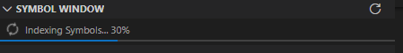

#### Deep Search (Fallback)
 
*Available when Database Mode is disabled or indexing is in progress.*
If the database is not ready, you can manually trigger a **Deep Search**:
- **Toggle Details**: Click the `...` icon in the search bar.
- **Scope**: Limit search to specific folders or glob patterns.
- **Mechanism**: Uses `ripgrep` to scan text when LSP is insufficient.

#### Zap Indicator
 
You may see a **Zap icon** next to some results.
-   **Meaning**: The result was found via **Text Search** (Deep Search), not the Language Server.
-   **Why**: This indicates a "potential" match found by scanning text when the standard Language Server returned incomplete results (e.g., in dynamic languages or macros).
-   **Verification**: For **Incoming/Outgoing** calls, the extension also verifies these results with the **Symbol Database** (if enabled) to ensure accuracy.

### Symbol Window

1.  **Open**: Click the "Symbol Window" icon in the Activity Bar. 

2.  **Search**:
    -   `Ctrl+Shift+O`: Focus **Current Document** search.
    -   `Ctrl+T`: Focus **Project Workspace** search.
3.  **Switch Modes**: Click the "Toggle Mode" icon to switch between "Current Document" and "Project Workspace". 

4.  **Refresh**: Click "Refresh" to reload symbols. 

5.  **Filter**: Click "Filter" to select which symbol kinds to display. 

6.  **Navigate**:
    - **Current Window**
        - **Click**: Jump to symbol name.
        - **Double-Click**: Select definition range.
    - **Project Window**
        - **Click**: Preview in **Context Window** (if available).
        - **Double-Click**: Jump to symbol name.

#### Split View
 
Enable `symbolWindow.splitView` to separate "Current Document" and "Project Workspace" into two distinct views for simultaneous access. 
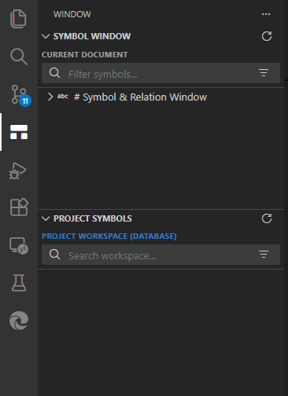 
You can drag the Project Window to the side to create a split layout. 
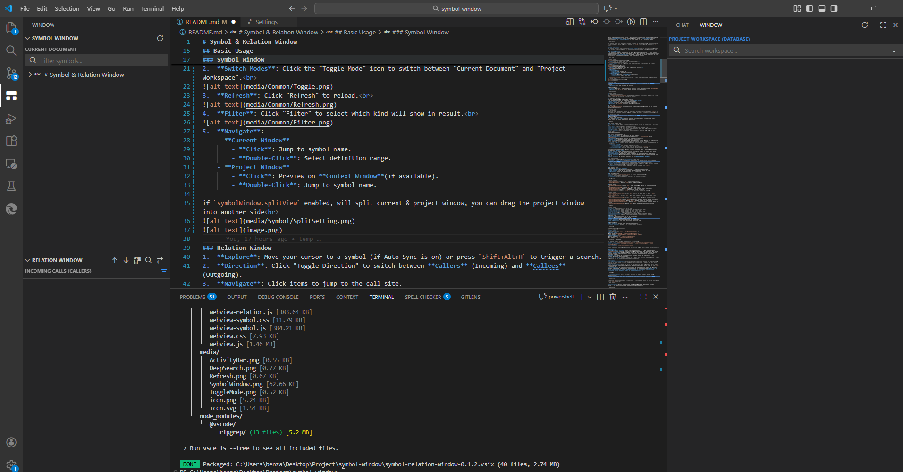 

### Relation Window
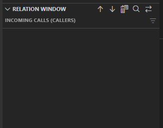 
1.  **Explore**: Click "Search" or press `Shift+Alt+H` to trigger a search for the symbol under the cursor. 
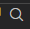
2.  **Direction**: Click "Toggle Direction" to switch between **Callers** (Incoming) and **Callees** (Outgoing). 

3.  **Filter**: Click "Filter" to select which symbol kinds to display. 

4.  **Navigate**: Click items to jump to the call site. Right-click in the outgoing list to open a menu to **Jump to Definition**. 
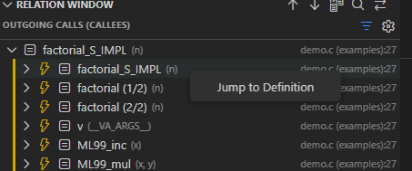

#### Dual Direction View
 
Enable `relationWindow.showBothDirections` to see Callers and Callees side-by-side. 
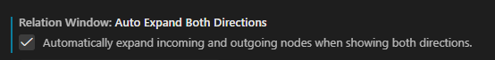 
By default, calls are not auto-expanded in this mode. You can enable `relationWindow.autoExpandBothDirections` in settings to automatically expand the two Category Nodes upon loading. 
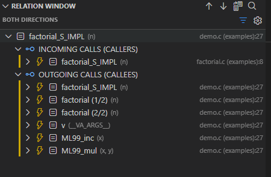 

### Reference Window
1.  **Lookup**: Right-click a symbol in the editor and select "Lookup References" (or press `Shift+Alt+F12`). You can also use the reference button in the Relation Window. 
 
 
2.  **Navigate**: Use `F1` / `F2` to cycle through references, click in the list, or use the navigation buttons in the Relation Window. 

### Global Status Bar
A global status bar in the bottom left shows the database status. 
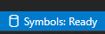 
Click it to show rebuild options in the Command Palette. 
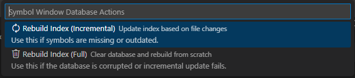 

## Advanced Usage

### Database Configuration
For large workspaces, you can fine-tune the indexing performance and scope via settings:
-   **Scope Control**: Use `shared.includeFiles` and `shared.excludeFiles` to control exactly which files are indexed.
-   **Performance**: Adjust `shared.indexingBatchSize` (default: 15) to control CPU usage during indexing.
-   **Cache**: Increase `shared.database.cacheSizeMB` (default: 64MB) for very large projects.

### Symbol Parsing (C/C++ Support)
The extension can clean up symbol names for a better view (e.g., removing function parameters).
-   **Setting**: `symbolWindow.symbolParsing.mode`
-   **Options**:
    -   `auto`: (Default) Automatically detects language.
    -   `c-style`: Forces C/C++ style parsing.
    -   `default`: Uses raw LSP names.

*Note: The parsing logic is extensible via an interface. If you need custom parsing for a specific language, you are welcome to implement a parser and submit a Pull Request.*

### Relation Window Features
-   **Hybrid Search**: Combines LSP and Text Search to find callers in dynamic languages or macros. Results found via text search are marked with a Zap icon `$(zap)`.
-   **Auto-Sync**: Enable `relationWindow.autoSearch` to automatically update the call hierarchy as you move your cursor.

## Features

### 1. Current Document Mode
- **Tree View**: Displays symbols (functions, classes, variables, etc.) of the active file in a hierarchical tree.
- **Auto-Sync**: Automatically updates when you switch tabs.
- **Real-time Filtering**: Type in the search bar to instantly filter the symbol tree.
- **Kind Filtering**: Click the filter icon to show/hide specific symbol types (e.g., Classes, Methods).
- **Navigate**: Click a symbol to jump to its name.
- **Select Definition**: Double-click a symbol to select its entire definition range (e.g., the whole function body).
- **Split View**: Option to display "Current Document" and "Project Workspace" views simultaneously (configurable via settings).

### 2. Project Workspace Standard Mode
- **Global Search**: Search for symbols across the entire workspace.
- **Multi-keyword Support**: Supports space-separated keywords (e.g., `user controller` matches `UserController`).
- **Performance**: Optimized with debouncing and caching for large projects.
- **Infinite Scroll**: Automatically loads more results as you scroll.
- **Deep Search**: A powerful hybrid search mode that combines text scanning (Ripgrep) with symbol parsing (LSP) to find results in large projects where standard LSP searches might be truncated.
    - **Manual Trigger**: Available via the "Deep Search" button (vertical ellipsis) when Database Mode is not active.
    - **Advanced Filtering**:
        - **Search Scope**: Limit the search to a specific folder.
        - **Files to Include**: Filter results using glob patterns (e.g., `src/**/*.ts`).
    - **Optimized Matching**: Uses regex permutations for fast multi-keyword matching.

### 3. Project Workspace Database Mode
For large workspaces where standard LSP search is slow or incomplete, Symbol & Relation Window now offers a high-performance **Database Mode**.
- **SQLite Backend**: Indexes workspace symbols into a local SQLite database for instant search results.
- **Persistent Index**: The index persists across sessions.
- **Incremental Updates**: Automatically detects file changes and updates the index in the background.
- **Global Status Bar**: Monitor indexing progress and control database rebuilds directly from the VS Code Status Bar.
- **Visual Indicator**: The UI clearly labels this mode as **PROJECT WORKSPACE (DATABASE)**.

### 4. Relation Window
A dedicated view for exploring the **Call Hierarchy** of your code.
-   **Incoming & Outgoing Calls**: Easily switch between seeing who calls a function (Callers) and what functions it calls (Callees).
-   **Auto-Sync**: Optionally updates the view as you move your cursor (enabled via settings).
-   **Hybrid Call Hierarchy**: Executes LSP calls and Text Search in parallel, merging results to ensure you find callers even in dynamic languages or complex C/C++ macros.
-   **Zap Indicator**: Results found via Deep Search are marked with a zap icon `$(zap)`.
-   **Dual-Direction Filter**: In "Both Directions" mode, independently filter Incoming and Outgoing results.

### 5. Reference Window
A dedicated view for **Lookup References**.
-   **Find References**: Quickly find all references to a symbol across the workspace.
-   **Code Preview**: Preview the code surrounding the reference without opening the file.
-   **Navigation**: Jump to the reference location with a single click.

### 6. Native Experience
- **UI**: Built with `@vscode/webview-ui-toolkit` to match VS Code's native design.
- **Icons**: Uses standard VS Code Codicons.
- **Theme Aware**: Automatically adapts to Light, Dark, and High Contrast themes.

## Configuration

### Window Enablement
- `symbolWindow.enable`: (Default: `true`) Enable the Symbol Window.
- `relationWindow.enable`: (Default: `true`) Enable the Relation Window.
- `referenceWindow.enable`: (Default: `true`) Enable the Reference Window.

### Shared Settings
- `shared.enableDatabaseMode`: (Default: `true`) Enable Database Mode (SQLite) for instant project-wide search.
- `shared.database.cacheSizeMB`: (Default: `64`) SQLite cache size in MB.
- `shared.indexingBatchSize`: (Default: `15`) Number of files to process in each indexing batch.
- `shared.includeFiles`: (Default: `""`) Glob patterns to include in indexing.
- `shared.excludeFiles`: (Default: `**/*.md, ...`) Glob patterns to exclude from indexing.

### Symbol Window
- `symbolWindow.symbolParsing.mode`: (Default: `auto`) Controls how symbol names are parsed (`auto`, `c-style`, `default`).
- `symbolWindow.splitView`: (Default: `false`) Split Symbol Window into "Current Document" and "Project Symbols" views.
- `symbolWindow.enableHighlighting`: (Default: `true`) Enable keyword highlighting in search results.

### Relation Window
- `relationWindow.autoSearch`: (Default: `false`) Automatically search for relations when the cursor moves.
- `relationWindow.showBothDirections`: (Default: `false`) Show both incoming and outgoing calls.
- `relationWindow.autoExpandBothDirections`: (Default: `false`) Automatically expand nodes when showing both directions.
- `relationWindow.enableDeepSearch`: (Default: `true`) Enable Deep Search (text scanning) fallback.

## Commands

### Symbol Window
- **Refresh**: Reloads symbols for the current view.
- **Toggle Mode**: Switches between Current Document and Project Workspace modes.
- **Focus Project Search**: Focuses the search bar in the Project view.
- **Focus Current Search**: Focuses the search bar in the Current Document view.
- **Deep Search**: Triggers a deep text-based search (Project Mode).
- **Rebuild Index (Incremental)**: Triggers a safe, incremental update of the symbol database.
- **Rebuild Index (Full)**: Completely clears the database and re-indexes the entire workspace.

### Relation Window
- **Refresh**: Reloads the relation tree for the current symbol.
- **Search**: Manually triggers a relation search.
- **Toggle Direction**: Switches between Callers and Callees.
- **Lookup References**: Finds all references to the current symbol.
- **Jump to Definition**: Jumps to the definition of the selected symbol.

### Reference Window
- **Next Reference**: Navigates to the next reference in the list.
- **Previous Reference**: Navigates to the previous reference in the list.

## Limitations & Enhancements

This extension is built on top of VS Code's native APIs (Symbol, Call Hierarchy, and Reference Providers). While it inherits the underlying capabilities of your installed Language Server Protocol (LSP) extensions, it also provides significant enhancements:

**Enhancements:**
- **Smart Multi-Keyword Matching**: Supports order-independent search (e.g., "User Controller" finds `UserController`) using client-side filtering (Current Mode) and optimized regex permutations (Deep Search).
- **Hybrid Call Hierarchy**: The Relation Window executes LSP calls and Text Search in parallel, merging results to ensure you find callers even in dynamic languages or complex C/C++ macros where standard IntelliSense might fail.
- **Database Mode**: Solves the "incomplete results" problem of standard LSP by maintaining a full, persistent SQLite index of workspace symbols.
- **Persistent Tree View**: Unlike the transient "Go to Symbol" quick pick, this extension provides a stable, navigable tree view for both document symbols and call hierarchies.

**Limitations:**
- **LSP Dependency (Standard Mode)**: Without Database Mode, the extension relies on the installed language server. If the server is slow or returns incomplete results, the extension's "Standard Mode" will reflect those limitations.
- **Deep Search Precision**: While "Deep Search" and "Hybrid Relation Search" significantly improve recall (finding missing items), they rely on text scanning (`ripgrep`), which may occasionally return false positives compared to purely semantic LSP results. The extension marks these results with a Zap icon `$(zap)` to distinguish them.
- **Initial Indexing**: The extension initially relies on the language server to warm up. However, once the internal Database Indexing is complete, the extension unlocks its full potential, offering instant, workspace-wide searches that bypass standard LSP performance bottlenecks.

## Future Work

-   **History Navigation**: Restore Back/Forward buttons in the Relation Window to navigate through exploration history.
-   **Lock View**: Add a "Lock" button to temporarily freeze the Relation Window on a specific symbol.

## Documentation

For a detailed technical specification of the extension's architecture, UI design, and internal logic, please refer to [SPEC.md](Spec.md).

## Known Issues

- **Initial Loading**: For very large workspaces, the "Project Mode" might show "Waiting for symbol provider..." for a few seconds while the language server indexes the project.

## Contributing

See [CONTRIBUTING.md](CONTRIBUTING.md) for instructions on how to build and contribute to the project.

## License

[MIT](LICENSE)
