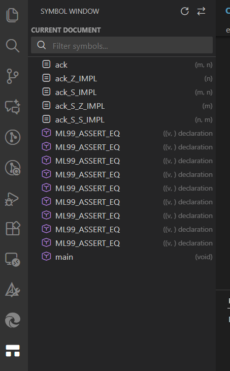

# Symbol Window

A Visual Studio Code extension that provides a "Source Insight"-like symbol navigation experience. It offers a dedicated side panel to browse symbols in the current document or search across the entire workspace with a native look and feel.

## Features

### 1. Current Document Mode
- **Tree View**: Displays symbols (functions, classes, variables, etc.) of the active file in a hierarchical tree.
- **Auto-Sync**: Automatically updates when you switch tabs.
- **Real-time Filtering**: Type in the search bar to instantly filter the symbol tree.
- **Jump to Definition**: Double-click a symbol to jump to its location in the editor.

### 2. Project Workspace Mode
- **Global Search**: Search for symbols across the entire workspace.
- **Multi-keyword Support**: Supports space-separated keywords (e.g., `user controller` matches `UserController`).
- **Performance**: Optimized with debouncing and caching for large projects.
- **Infinite Scroll**: Automatically loads more results as you scroll.

### 3. Native Experience
- **UI**: Built with `@vscode/webview-ui-toolkit` to match VS Code's native design.
- **Icons**: Uses standard VS Code Codicons.
- **Theme Aware**: Automatically adapts to Light, Dark, and High Contrast themes.

## Configuration

You can customize the appearance of the symbol list via VS Code settings:

- **`symbolWindow.cleanCStyleTypes`** (Default: `true`):  
  Moves C-style type suffixes (e.g., `(typedef)`, `(struct)`) from the symbol name to the detail view (gray text).
  
- **`symbolWindow.moveSignatureToDetail`** (Default: `true`):  
  Moves function signatures/parameters (e.g., `(int a, char b)`) from the symbol name to the detail view.

## Usage

1.  **Open the View**: Click the "Symbol Window" icon in the Activity Bar (usually on the left). 

2.  **Switch Modes**: Click the "Toggle Mode" icon in the view title area (top right of the panel) to switch between "Current Document" and "Project Workspace". 

3.  **Refresh**: Click the "Refresh" icon to reload symbols or clear the search cache. 

4.  **Navigate**:
    - **Click**: Select a symbol.
    - **Double-Click**: Jump to the symbol in the editor.
    - **Arrow Keys**: Navigate the list.
    - **Enter**: Jump to the selected symbol.

## Requirements

This extension relies on VS Code's built-in symbol providers. You must have a language extension installed for the files you are editing (e.g., C/C++ extension for `.c/.cpp` files, TypeScript extension for `.ts` files).

**Note on Large Projects:**
If you open a large workspace, the extension may show a "Waiting for symbol provider..." status initially. This is normal and indicates that the language server (e.g., C/C++ IntelliSense) is still indexing your files. The view will automatically unlock once the provider is ready.

## Limitations & Enhancements

This extension is built on top of VS Code's native Symbol APIs (`vscode.executeDocumentSymbolProvider` and `vscode.executeWorkspaceSymbolProvider`). While it inherits the underlying capabilities of your installed Language Server Protocol (LSP) extensions, it also provides significant enhancements:

**Enhancements:**
- **Multi-Keyword Search**: Unlike standard VS Code search which often requires exact order, Symbol Window supports space-separated keywords (e.g., `User Controller`) and performs a client-side intersection. This allows for order-independent matching and more precise filtering.
- **Structure Visualization**: Provides a persistent tree view for the current document, unlike the transient "Go to Symbol" quick pick.

**Limitations:**
- **Search Results**: The completeness of the *initial* search results depends on the language extension. If the LSP truncates results (e.g., returns only the first 100 matches for "User"), our enhanced filtering can only operate on that subset.
- **Indexing Speed**: The "Readiness" of the symbol window depends on how fast your language extension can index the workspace.

## Future Work

1.  **Enhanced Search Capabilities**: Implement advanced search strategies (e.g., hybrid text search) to overcome LSP result truncation limits in large projects.
2.  **Relation Window**: A planned feature to visualize call hierarchies and symbol relationships (Callers/Callees) directly within the side panel.

## Known Issues

- **Sync Selection**: Currently, clicking a symbol in the editor does not automatically highlight it in the Symbol Window list (Planned feature).
- **Initial Loading**: For very large workspaces, the "Project Mode" might show "Waiting for symbol provider..." for a few seconds while the language server indexes the project.

## Contributing

See [CONTRIBUTING.md](CONTRIBUTING.md) for instructions on how to build and contribute to the project.

## License

[MIT](LICENSE)
